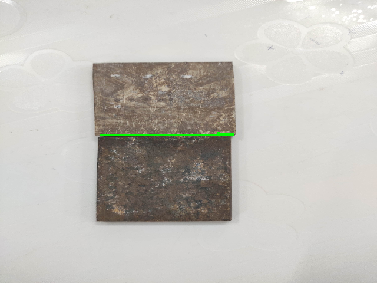

# butt_welding

This is a algorithm developed for detecting the butt weld joints using image processing techniques. It is having two inputs, a image of the welding environment without the weld workpiece and a image after the workpiece setup. It uses background elimination techniques to extract the image of the workpiece from the enviornment. The algorithm is explained in detail [here](butt_welding.pdf)

## Development Environment
- __Ubuntu 16.04.2__
- __python 2.7__
- __OpenCv 3.3.1__

##  Python dependencies

- numpy 
- cv2 
- image_geometry
- argparse
- time
- skimage
- datetime

__Step 1: Install the dependencies__

Install the mentioned python dependencies.

__Step 2: Save the images__

Save the background and forground images of the weld envrionment

__Step 3: Run the python program__

Run the python programm butt_weld.py.

It will promt to enter the name of the background and foreground images. 

The final results will be saved to the output folder.

Set show_image flag in every function as '1' to display the images after each step. 

    

